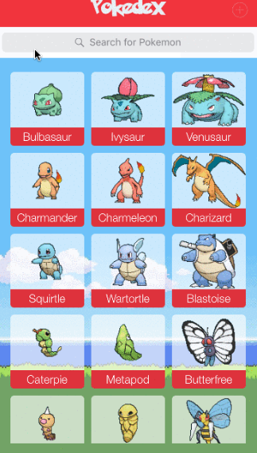

# Pré-requisitos
## O que pode usar?
- ES6
- Linter e editorconfig
- Task runners
- Usar metodologia de arquitetura de CSS e JS.
- Sass e SCSS

## O que é legal evitar?
- Framworks JS
- Bibliotecas (axios, underscore etc)
- Framworks/ Bibliotecas CSS (Bootstrap, Foundation, Materializecss etc)

## Qual o objetivo?
O objetivo real do exercício é evoluir a base de conhecimento em JavaScript e melhorar e conhecer as metodologias aplicadas no CSS.
No final o que queremos é, ver quais estratégias foram usadas para resolver o desafio e ajudar a melhorar a base de conhecimento.
O legal será trabalhar com processo de review do código no final, para poder entender onde pode melhorar.

## O desafio:
Basicamente o desafio consiste em entregar uma Pokédex com uma lista de Pokemons, contendo:
- Nome
- Habilidade

A idéia é usar uma API já existente, a `PokéAPI`:
```
https://pokeapi.co/api/v2/pokemon
```

Não precisa se preocupar com as imagens dos Pokemons.
Porém pode seguir o layout:




## Dicas:
Como o legal é entender bem o JavaScript e CSS, temos alguns sites que vão ajudar na hora de desenvolver.

[FecthAPI](https://developer.mozilla.org/pt-BR/docs/Web/API/Fetch_API),
[ParentNode.append() - Web APIs | MDN](https://developer.mozilla.org/en-US/docs/Web/API/ParentNode/append),
[CSS](https://tableless.com.br/oocss-smacss-bem-dry-css-afinal-como-escrever-css/)

Lembre que qualquer dúvida estaremos aqui para ajudar! 🖤